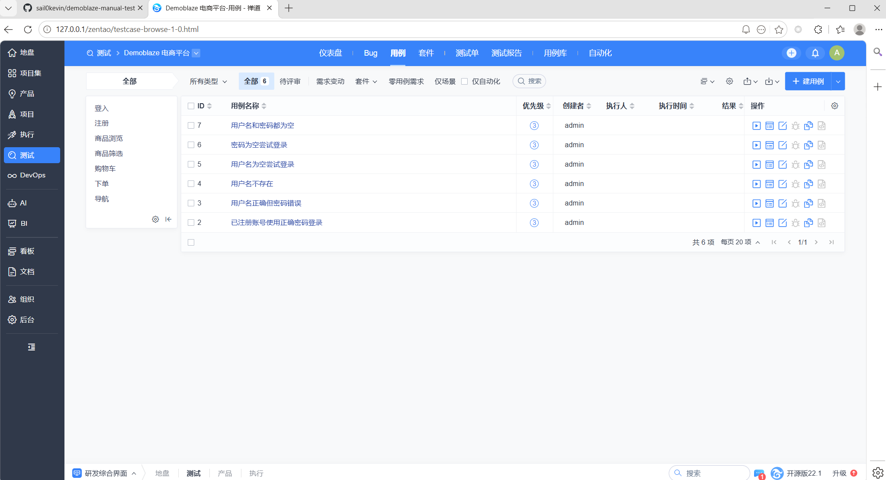
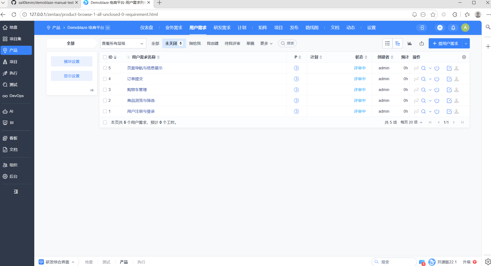
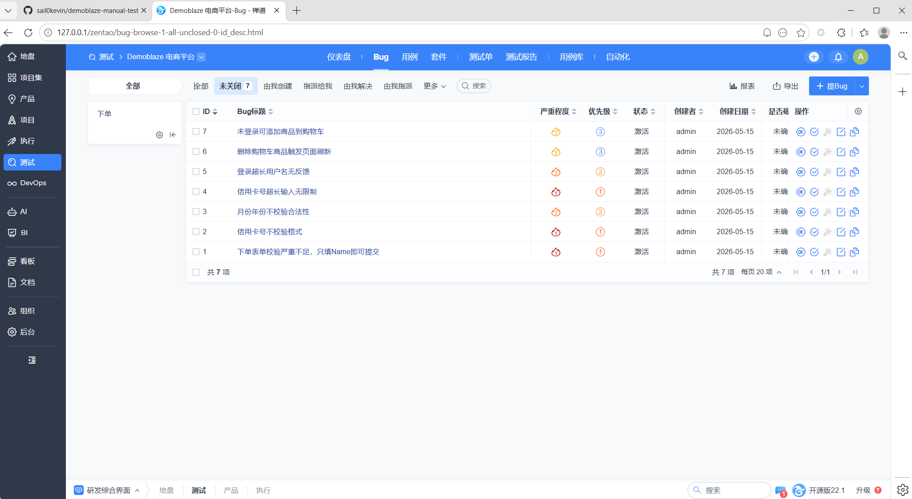
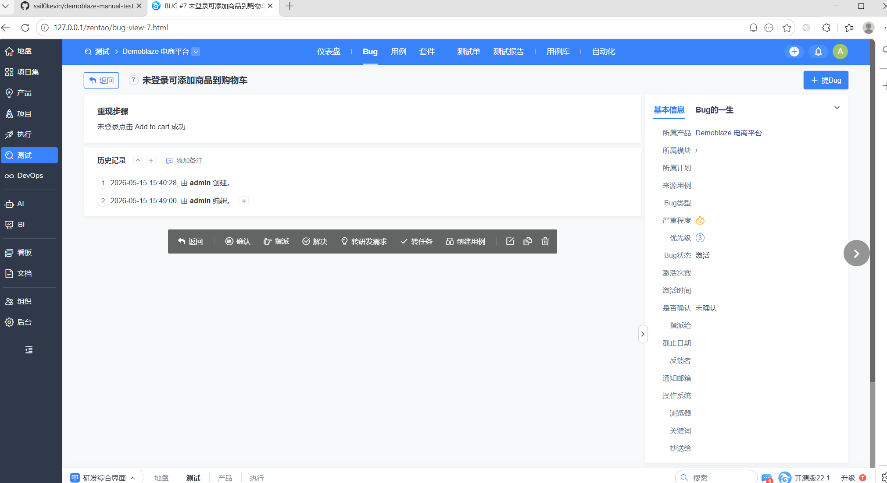

# Demoblaze 手工功能测试

> 对 Demoblaze 电商平台进行全面手工功能测试，覆盖 6 大模块 49 条用例，发现 7 个缺陷。

---

## 项目简介

本项目是对 [Demoblaze](https://demoblaze.com) 电商平台的一次完整手工功能测试。按照真实软件测试流程：**需求分析 → 用例设计 → 测试执行 → Bug 提交 → 测试报告**，完整还原企业级测试工作流。

---

## 测试流程

```
需求分析 → 功能模块划分 → 编写测试用例 → 执行测试 → 提交 Bug → 输出测试报告
```

---

## 测试范围

| 模块 | 用例数 | 通过 | 失败 |
|------|--------|------|------|
| 登录 | 8 | 8 | 0 |
| 注册 | 7 | 7 | 0 |
| 商品浏览与筛选 | 10 | 10 | 0 |
| 购物车 | 8 | 6 | 2 |
| 下单 | 8 | 4 | 4 |
| 导航与页面跳转 | 8 | 8 | 0 |
| **合计** | **49** | **42** | **7** |

---

## Bug 概览

| 严重程度 | 数量 | 核心问题 |
|----------|------|----------|
| 高 | 2 | 下单表单校验缺失、信用卡号无格式校验 |
| 中 | 2 | 日期字段无校验、卡号无长度限制 |
| 低 | 3 | 登录超长输入无反馈、购物车删除刷新、未登录权限不明确 |

**核心发现：下单模块输入校验严重缺失。**

---

## 项目结构

```
web-test-project/
├── README.md
├── 测试用例_禅道导入.csv      # 49条用例CSV导入模板
├── docs/
│   ├── 01-功能分析.md         # 需求分析与功能模块划分
│   ├── 02-测试用例.md         # 49条测试用例（含优先级）
│   ├── 03-Bug报告.md          # 7个缺陷的详细报告
│   └── 04-测试报告.md         # 完整测试总结报告
└── screenshots/
    ├── bugs/
    │   ├── 03-Bug列表.png      # 禅道Bug列表（7条）
    │   └── 04-Bug详情示例.png   # 单条Bug详情
    └── cases/
        ├── 01-产品与需求.png    # 禅道产品 + 5条需求
        └── 02-用例列表.png      # 禅道用例列表
```

---

## 禅道使用

本项目的需求管理、用例管理和缺陷跟踪均通过禅道完成：

- **产品管理**：创建产品 → 录入 5 条需求
- **用例管理**：手工录入核心用例 + CSV 批量导入模板（49条）
- **缺陷管理**：提交 7 条 Bug，含复现步骤和严重程度定级
- **测试报告**：禅道自动汇总 + 手动编写完整测试报告






---

## 测试方法论

- **等价类划分** — 有效 / 无效输入分类
- **边界值分析** — 空值、单字符、超长字符串
- **异常场景优先** — 每个模块重点覆盖非法输入和极端情况
- **优先级分级** — 高/中/低三级，高风险模块优先测试

---

## 环境

| 环境 | 版本 |
|------|------|
| OS | Windows 11 |
| Browser | Google Chrome 136 |
| 测试方式 | 手工黑盒测试 |

---

## 作者

**[Your Name]** — 软件测试工程师（求职中）
